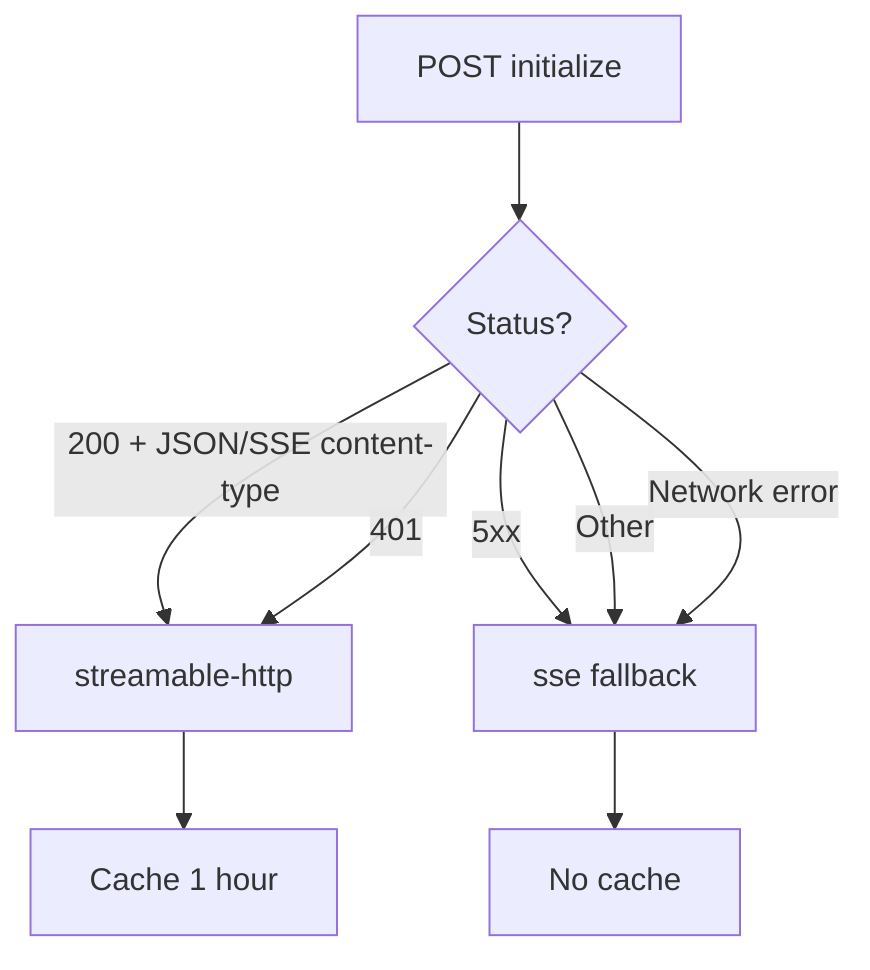

# Agent MCP Tool Injection Architecture

> Source analysis of `D:\work\BrowserOS\packages\browseros-agent\apps\server\src\agent`

## Overview

BrowserOS Agent uses two distinct paths to inject MCP tools into the LLM, depending on the provider type:

| Provider Type | Tool Injection Method | Key Files |
|---|---|---|
| Model-Backed (OpenAI, Anthropic, Google, etc.) | In-process `ToolSet` objects passed to AI SDK `ToolLoopAgent` | `tool-adapter.ts`, `mcp-builder.ts`, `nudge-tools.ts` |
| ACP-Backed (Claude Code, Codex, custom ACP) | MCP server URLs passed to spawned agent process | `buildAcpMcpServers.ts`, `buildBrowserOsSelfMcp.ts`, `buildAcpxProvider.ts` |

The decision point is `isAcpProvider(provider)` — if true, all in-process tool builders are bypassed and tools are delivered exclusively through the MCP boundary.

---

## Path 1: Model-Backed Providers (In-Process Tools)

### Architecture

```
┌─────────────────────────────────────────────────────────┐
│                    AiSdkAgent.create()                   │
│                       (ai-sdk-agent.ts)                  │
│                                                          │
│  ┌──────────────┐  ┌──────────────┐  ┌───────────────┐ │
│  │ BrowserTools │  │ CustomMcp    │  │ KlavisTools   │ │
│  │ (tool-       │  │ (mcp-        │  │ (klavis       │ │
│  │  adapter.ts) │  │  builder.ts) │  │  service)     │ │
│  └──────┬───────┘  └──────┬───────┘  └──────┬────────┘ │
│         │                 │                 │           │
│         │     ┌───────────┘                 │           │
│         │     │  (merge + collision filter)  │           │
│         ▼     ▼                               ▼          │
│  ┌──────────────────────────────────────────────────┐   │
│  │            FilesystemTools + NudgeTools           │   │
│  └──────────────────────┬───────────────────────────┘   │
│                         │                               │
│                         ▼                               │
│              ┌─────────────────────┐                    │
│              │   ToolLoopAgent     │                    │
│              │   (AI SDK)          │                    │
│              └─────────────────────┘                    │
└─────────────────────────────────────────────────────────┘
```

### 1.1 Browser Tools (`tool-adapter.ts`)

`buildBrowserToolSet(session, options)` converts the 16 `BROWSER_TOOLS` definitions from `@browseros/browser-mcp/registry` into AI SDK `tool()` objects:

```typescript
for (const def of BROWSER_TOOLS) {
  toolSet[def.name] = tool({
    description: def.description,
    inputSchema: def.input,        // Zod schema → AI SDK input schema
    execute: async (params, { abortSignal }) => {
      // 1. Apply 120s timeout via withBrowserToolTimeout()
      // 2. Apply readOnlyGuard (chat mode restricts tabs to list/active)
      // 3. Execute via executeBrowserTool(def, params, { session, signal })
      // 4. Log metrics: tool_name, duration_ms, success
      return { content: result.content, isError: result.isError }
    },
    toModelOutput: ({ output }) => {
      // Convert ContentBlock[] → LanguageModelV2ToolResultOutput
      // Text-only → { type: 'text', value }
      // Has images → { type: 'content', value: [...] }
      // Error → { type: 'error-text', value }
    },
  })
}
```

Key details:
- **Timeout**: Every browser tool gets a 120-second `AbortSignal.timeout` merged with any caller-provided signal
- **ReadOnly guard**: In chat mode, `tabs` is restricted to `action="list"` or `"active"` only
- **Output conversion**: `toModelOutput` handles text, image, and error results differently for the LLM

### 1.2 Custom MCP Tools (`mcp-builder.ts`)

Two-phase process: spec resolution + client connection.

**Phase 1: Build specs** — `buildMcpServerSpecs({ browserContext })`
- Reads `browserContext.customMcpServers` (user-configured external MCP URLs)
- For each URL, calls `detectMcpTransport(url)` to determine transport type
- Returns `McpServerSpec[]` with `{ name, url, transport }`

**Phase 2: Connect clients** — `createMcpClients(specs)`
- For each spec, calls `createMCPClient()` from `@ai-sdk/mcp`
- Transport selection: `spec.transport === 'sse' ? 'sse' : 'http'`
- Each connection has a timeout (`TIMEOUTS.MCP_CLIENT_CONNECT`)
- Failed connections are logged and skipped (return `null`), not fatal
- `client.tools()` returns a `ToolSet` that gets merged into the final set

```typescript
const results = await Promise.all(specs.map(connectMcpClient))
for (const result of results) {
  if (result) {
    clients.push(result.client)
    tools = { ...tools, ...result.tools }
  }
}
```

### 1.3 Transport Auto-Detection (`mcp-transport-detect.ts`)

Probes the server endpoint with an `initialize` POST request:



- Sends `Accept: application/json, text/event-stream` header
- Checks response Content-Type: `application/json` or `text/event-stream` → streamable-http
- 401 → streamable-http (auth required, but transport is HTTP)
- 5xx or network error → SSE fallback (older server or wrong endpoint)
- Results cached for 1 hour per URL

### 1.4 Klavis Connector Tools

External SaaS integrations (Gmail, Slack, Linear, etc.) managed by the Klavis service:

```typescript
const klavisTools = config.klavis.buildAiSdkToolSet({
  selectedServerNames: config.browserContext?.enabledMcpServers,
})
```

- Filtered by `enabledMcpServers` in browser context
- Built as AI SDK `tool()` objects directly (no MCP client needed)

### 1.5 Tool Merging & Collision Resolution

Final tool set assembly in `AiSdkAgent.create()`:

```typescript
const tools = {
  ...browserTools,       // 16 browser tools (reserved names)
  ...externalMcpTools,    // Custom MCP + Klavis (filtered)
  ...filesystemTools,     // Read/write tools (workspace-gated)
  ...buildNudgeToolSet(),  // suggest_schedule, suggest_app_connection
}
```

Collision rules:
1. **Browser tool names are reserved** — `withoutReservedBrowserToolNames()` strips any external tool whose name matches a browser tool (e.g., if a custom MCP server exposes a `tabs` tool, it's dropped with a warning)
2. **Custom MCP overrides Klavis** — If a custom MCP tool has the same name as a Klavis tool, the custom one wins (with a warning log)

### 1.6 Mode-Specific Filtering

| Mode | Effect on tools |
|---|---|
| **Chat mode** (`chatMode: true`) | Only `readOnlyHint` tools + `tabs` (list/active only). No nudge tools. |
| **Scheduled task** (`isScheduledTask: true`) | `suggest_schedule` and `suggest_app_connection` removed. |
| **ACP mode** (`isAcpProvider: true`) | ALL in-process tools skipped. Tools delivered via MCP boundary. |

Chat mode tool filter (`chat-mode.ts`):
```typescript
export const CHAT_MODE_ALLOWED_TOOLS = new Set([
  ...BROWSER_TOOLS.filter(t => t.annotations?.readOnlyHint).map(t => t.name),
  'tabs',
])
```

### 1.7 External MCP Tool Metrics Wrapping

Every external MCP tool (Klavis + custom) is wrapped with timing and logging:

```typescript
externalMcpTools[name] = {
  ...t,
  execute: async (...args) => {
    const startTime = performance.now()
    try {
      const result = await originalExecute(...args)
      metrics.log('tool_executed', { tool_name, duration_ms, success, source: 'chat' })
      return result
    } catch (error) {
      metrics.log('tool_executed', { tool_name, duration_ms, success: false, error_message })
      throw error
    }
  }
}
```

---

## Path 2: ACP-Backed Providers (MCP Boundary)

### Architecture

```
┌──────────────────────────────────────────────────┐
│              createAcpLanguageModel()             │
│               (provider-factory.ts)               │
│                                                   │
│  ┌─────────────────────────────────────────────┐ │
│  │         buildAcpMcpServers()                │ │
│  │  (buildAcpMcpServers.ts)                    │ │
│  │                                             │ │
│  │  1. BrowserOS self-MCP entry (always first) │ │
│  │     → http://127.0.0.1:{port}/mcp           │ │
│  │     → headers: scope-id, agent-id, ...     │ │
│  │                                             │ │
│  │  2. Custom MCP servers from browserContext  │ │
│  │     → type: 'http', name, url              │ │
│  └──────────────────┬──────────────────────────┘ │
│                     │                            │
│                     ▼                            │
│  ┌─────────────────────────────────────────────┐ │
│  │         buildAcpxProvider()                 │ │
│  │  (buildAcpxProvider.ts)                     │ │
│  │                                             │ │
│  │  - Spawns agent process (claude/codex)      │ │
│  │  - Passes mcpServers to acpx config         │ │
│  │  - Sets permissionMode: 'approve-all'        │ │
│  │  - Applies dangerously-allow mode            │ │
│  └──────────────────┬──────────────────────────┘ │
│                     │                            │
│                     ▼                            │
│         Spawned Agent Process                     │
│    (connects to MCP URLs directly)               │
└──────────────────────────────────────────────────┘
```

### 2.1 MCP Server Assembly (`buildAcpMcpServers.ts`)

```typescript
export function buildAcpMcpServers(opts): McpServerSpec[] {
  const out: McpServerSpec[] = [buildBrowserOsSelfMcpEntry(opts)]
  for (const server of opts.customMcpServers ?? []) {
    out.push({ type: 'http', name: server.name, url: server.url, headers: [] })
  }
  return out
}
```

BrowserOS's own MCP entry is always first — it wins on duplicate names.

### 2.2 Self-MCP Entry (`buildBrowserOsSelfMcp.ts`)

Points the spawned agent at BrowserOS's own `/mcp` route:

```typescript
{
  type: 'http',
  name: 'browseros',
  url: `http://127.0.0.1:${serverPort}/mcp`,
  headers: [
    { name: 'X-BrowserOS-Scope-Id', value: conversationId },
    { name: 'X-BrowserOS-Agent-Id', value: providerId },
    // Optional: X-BrowserOS-Default-Window-Id, X-BrowserOS-Default-Tab-Group-Id
    // Optional: X-BrowserOS-Managed-Mcp-Servers (comma-encoded connector names)
  ]
}
```

Headers carry per-conversation isolation tokens so concurrent conversations never see each other's tool state.

### 2.3 Provider Construction (`buildAcpxProvider.ts`)

```typescript
const provider = await buildAcpxProvider({
  conversationId,
  agentId,                    // 'claude' | 'codex' | custom
  workspacePath,
  agentRegistryOverrides,     // bundled-Bun launcher overrides
  mcpServers: config.acpMcpServers,
})
```

- `mcpServers` are converted to acpx's `AcpxMcpServerConfig` shape via `toProviderShape()`
- `permissionMode` defaults to `'approve-all'` (read + write without UI gate)
- `applyDangerouslyAllowMode()` lifts the session to full permissions (equivalent to `--dangerously-skip-permissions`)

### 2.4 No In-Process Tools

```typescript
const useMcpBoundaryOnly = isAcpProvider(config.resolvedConfig.provider)
const allBrowserTools = useMcpBoundaryOnly
  ? {}                                    // ← empty
  : buildBrowserToolSet(config.browserSession, { ... })
```

When `useMcpBoundaryOnly` is true:
- `buildBrowserToolSet()` returns `{}`
- `buildMcpServerSpecs()` returns `[]`
- Klavis tools are skipped
- The spawned agent discovers all tools via MCP `tools/list` at runtime

---

## Recommendations for Agent-MCP Integration

### 1. Transport Detection

**Current approach**: Probe with `initialize` POST, check Content-Type, fall back to SSE.

**Recommendations**:
- Always support both `streamable-http` and `sse` on the MCP server side. The agent auto-detects, but SSE is a fallback — Streamable HTTP provides better connection reuse and lower latency.
- Cache transport detection results (BrowserOS caches for 1 hour). Transport type rarely changes within a session.
- Use the `Accept: application/json, text/event-stream` header on POST requests. Without it, Streamable HTTP servers return 406 Not Acceptable.

### 2. Connection Resilience

**Current approach**: Failed MCP connections are skipped (return `null`), logged as warnings.

**Recommendations**:
- Never let a single MCP server failure block agent creation. The `Promise.all` + null-filter pattern is good, but consider `Promise.allSettled` for clearer error semantics.
- Add reconnection logic for long-running sessions. Currently, if an MCP client disconnects mid-conversation, tools silently disappear.
- Set per-server timeouts. BrowserOS uses a global `TIMEOUTS.MCP_CLIENT_CONNECT`, but a slow server shouldn't block faster ones.

### 3. Tool Name Collision

**Current approach**: Browser tool names are reserved; external tools with matching names are dropped with a warning.

**Recommendations**:
- Prefix external MCP tool names with the server name to avoid collisions. E.g., `custom-gmail.send_email` instead of just `send_email`.
- Consider namespace grouping if the LLM supports it (e.g., `gmail__send_email`). This also helps the model distinguish between similar tools from different servers.
- Log collisions at `info` level, not just `warn` — operators need to see these in production.

### 4. Tool Result Conversion

**Current approach**: `toModelOutput` converts ContentBlock arrays to LLM output (text, content, or error-text).

**Recommendations**:
- Always implement `toModelOutput` for custom tools. The default behavior (JSON-serialize the entire result) wastes context window space and confuses the model.
- For image-heavy results (screenshots), consider returning a compressed text summary alongside the image. Some models struggle with raw image data without context.
- For error results, return `type: 'error-text'` so the model knows the tool failed. Plain text errors can be misinterpreted as successful results.

### 5. Timeout Management

**Current approach**: Browser tools get 120s timeout; MCP clients get `MCP_CLIENT_CONNECT` timeout.

**Recommendations**:
- Use `AbortSignal.any([callerSignal, timeoutSignal])` (or the polyfill in `withBrowserToolTimeout`) to merge caller and timeout signals. Never rely on a single source.
- Set shorter timeouts for read-only tools (snapshot, read) and longer for action tools (navigate, act). A 120s timeout on a simple `tabs list` is excessive.
- Propagate `AbortSignal` through the entire tool call chain. BrowserOS does this well — the signal flows from `ToolLoopAgent` → `execute` → `executeBrowserTool` → CDP commands.

### 6. Mode-Based Tool Filtering

**Current approach**: Chat mode filters to `readOnlyHint` tools + `tabs`; scheduled task removes nudge tools.

**Recommendations**:
- Use the `backend` field on `ToolDefinition` to filter by backend mode (already implemented in browser-control-mcp). BrowserOS-only tools (`windows`, `tab_groups`) should not appear when running on standard Chrome.
- Consider adding a `chatModeCompatible` or `readOnlyCompatible` flag to tool definitions instead of relying on `readOnlyHint` annotations. This would make the filtering more explicit.
- For ACP providers, the spawned agent should also receive mode information (via MCP server config or instruction file) so it can self-filter tools.

### 7. ACP Path (MCP Boundary)

**Current approach**: Pass MCP server URLs to spawned agent; agent discovers tools via `tools/list`.

**Recommendations**:
- Pass per-conversation isolation headers (`X-BrowserOS-Scope-Id`). This is critical for concurrent conversations sharing the same MCP server instance.
- Consider passing tool filtering hints via MCP server config (e.g., `readOnly: true` header). The spawned agent can use these to self-restrict its tool usage.
- The `approve-all` permission mode is appropriate for trusted BrowserOS sessions but should be configurable for enterprise deployments.
- Clean up spawned agent processes on conversation end. `AiSdkAgent.dispose()` calls `provider.close()` which terminates the child process.

### 8. Metrics & Observability

**Current approach**: Every tool execution logs `tool_name`, `duration_ms`, `success`, and `source`.

**Recommendations**:
- Log tool input summaries (not raw inputs) for debugging. BrowserOS's `summarizeBrowserToolParams` is a good pattern — it extracts key fields like `page`, `action`, `urlOrigin` without logging sensitive data.
- Track tool usage patterns (which tools are called most, which fail most) to inform prompt engineering and tool design.
- For external MCP tools, log the server name alongside the tool name. This helps identify which MCP server is causing issues.

### 9. Resource Cleanup

**Current approach**: `AiSdkAgent.dispose()` closes all MCP clients and the language model.

**Recommendations**:
- Always close MCP clients on conversation end. Leaked connections accumulate and exhaust connection pools.
- Use `.catch(() => {})` on close calls — a failing close shouldn't block cleanup of other resources.
- For ACP providers, ensure the spawned process is killed on dispose. The `provider.close()` call handles this, but verify with process listing in tests.

### 10. Prompt Integration

**Current approach**: System prompt includes tool catalog, selection strategy, and safety rules.

**Recommendations**:
- Include the full tool catalog in the system prompt so the model knows what tools are available without a `tools/list` round-trip.
- Add tool selection guidance: "Use `snapshot` before `act`; use `navigate` to change URL; use `run` for multi-step JavaScript flows."
- Mark deprecated or restricted tools in the prompt so the model avoids them.
- For ACP providers, write the prompt to the workspace instruction file (`CLAUDE.md` / `AGENTS.md`) so the spawned agent reads it on startup.

---

## File Reference

| File | Responsibility |
|---|---|
| `ai-sdk-agent.ts` | Main agent orchestrator; assembles all tool sets, creates `ToolLoopAgent` |
| `tool-adapter.ts` | Wraps `BROWSER_TOOLS` as AI SDK `tool()` objects with timeout, readOnly guard, output conversion |
| `mcp-builder.ts` | Resolves custom MCP server specs, connects clients, merges toolsets |
| `mcp-transport-detect.ts` | Auto-detects `streamable-http` vs `sse` by probing with `initialize` POST |
| `nudge-tools.ts` | UI sentinel tools: `suggest_schedule`, `suggest_app_connection` |
| `chat-mode.ts` | Defines `CHAT_MODE_ALLOWED_TOOLS` (readOnlyHint tools + `tabs`) |
| `prompt.ts` | System prompt builder with tool catalog, selection strategy, safety rules |
| `provider-factory.ts` | Creates `LanguageModel` from provider config; ACP path spawns agent process |
| `types.ts` | `ResolvedAgentConfig` — carries all agent config including `acpMcpServers` |
| `buildAcpMcpServers.ts` | Assembles MCP server list for ACP providers (BrowserOS self-MCP + custom) |
| `buildBrowserOsSelfMcp.ts` | Builds the self-MCP entry with isolation headers |
| `buildAcpxProvider.ts` | Constructs `AcpxProvider` with MCP servers, permission mode, agent registry |
