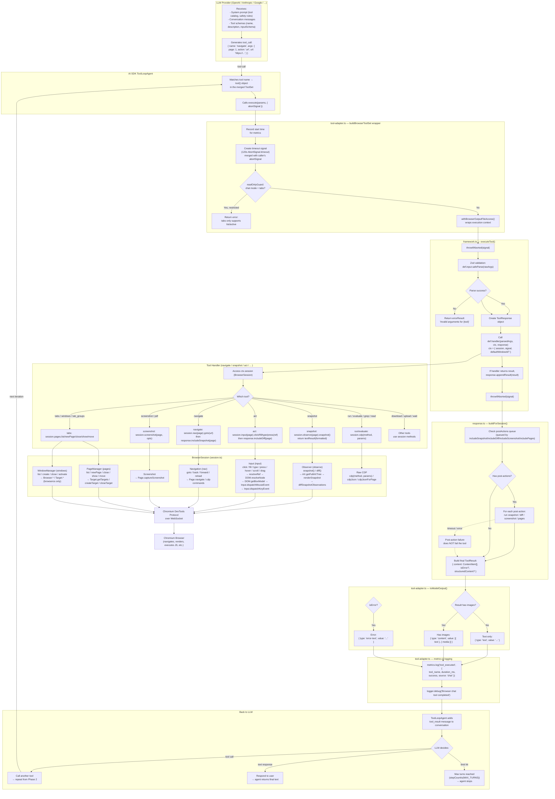

# Browser Tool Call Flow: AI Model → Browser Action → Result

> How the AI invokes the 16 `BROWSER_TOOLS` after they've been wrapped as AI SDK `tool()` objects.

## Overview

The AI SDK's `ToolLoopAgent` drives a **multi-turn tool-calling loop**. On each turn, the LLM receives the system prompt + conversation history + tool schemas, and responds with either a text reply (done) or one or more tool calls. Each tool call flows through a 7-layer pipeline before the result returns to the LLM.

```
LLM ──tool_call──► AI SDK ToolLoopAgent
                       │
                       ▼
                   tool().execute(params, { abortSignal })
                       │  (tool-adapter.ts)
                       ▼
                   executeBrowserTool(def, params, { session, signal })
                       │  (framework.ts)
                       ▼
                   def.handler(parsedArgs, ctx, response)
                       │  (each tool's handler)
                       ▼
                   BrowserSession.pages / .windows / .observe / .input / .nav
                       │  (session.ts)
                       ▼
                   CDP Commands (Target / Page / AX / DOM / Input)
                       │
                       ▼
                   Chromium Browser
                       │
                   result + post-actions
                       │  (response.ts buildForSession)
                       ▼
                   toModelOutput() → LanguageModelV2ToolResultOutput
                       │  (tool-adapter.ts)
                       ▼
LLM ◄──tool_result── AI SDK ToolLoopAgent
```

## Full Flowchart



## The 16 BROWSER_TOOLS and Their Session Access Patterns

| # | Tool | Session API Used | Post-Actions | readOnlyHint |
|---|---|---|---|---|
| 1 | `tabs` | `session.pages.list/newPage/close/show/move` | — | No |
| 2 | `tab_groups` | `session.pages` + `session.windows` | — | No |
| 3 | `navigate` | `session.nav(page).goto/back/forward/reload` + `session.pages.refresh` | `includeSnapshot(page)` | No |
| 4 | `snapshot` | `session.observe(page).snapshot()` | — | Yes |
| 5 | `diff` | `session.observe(page).diff()` | — | Yes |
| 6 | `act` | `session.input(page).click/fill/type/press/hover/scroll/drag` | `includeDiff(page)` | No |
| 7 | `download` | `session.pages.getSession` → `Page.downloadWillBegin` | — | No |
| 8 | `upload` | `session.input(page).setFileInputFiles` | — | No |
| 9 | `read` | `session.pages.getSession` → `DOM.readNodeTextContent` | — | Yes |
| 10 | `grep` | `session.pages.getSession` → `DOM.searchInPage` | — | Yes |
| 11 | `screenshot` | `session.screenshot(page, opts)` | — | Yes |
| 12 | `pdf` | `session.pages.getSession` → `Page.printToPDF` | — | No |
| 13 | `wait` | `session.observe(page).snapshot/diff` (polling) | — | Yes |
| 14 | `windows` | `session.windows.list/create/close/activate/setVisibility` | — | No |
| 15 | `evaluate` | `session.cdpJsonForPage(page, method, params)` | — | No |
| 16 | `run` | `session.cdp(method, params)` + `session.input/nav/screenshot` | `includeDiff` or `includeSnapshot` | No |

## Detailed Layer-by-Layer Walkthrough

### Layer 1: LLM Generates Tool Call

The `ToolLoopAgent` constructs an API request to the LLM containing:
- **System prompt** (from `prompt.ts`): Includes tool catalog, selection strategy, safety rules, mode-aware framing
- **Conversation messages**: Previous user messages + assistant messages + prior tool results
- **Tool schemas**: Each tool's `description` + `inputSchema` (Zod → JSON Schema) converted by AI SDK

The LLM responds with a tool call:
```json
{
  "name": "navigate",
  "arguments": { "page": 1, "action": "url", "url": "https://example.com" }
}
```

### Layer 2: AI SDK Dispatches (`ToolLoopAgent`)

The `ToolLoopAgent` matches the tool name against the `ToolSet` keys (e.g., `tools['navigate']`). It then calls:
```typescript
tool.execute({ page: 1, action: "url", url: "https://example.com" }, { abortSignal })
```

The `stopWhen: [stepCountIs(MAX_TURNS)]` setting on the agent controls maximum iterations.

### Layer 3: Tool Adapter Wrapper (`tool-adapter.ts`)

The `execute` function defined in `buildBrowserToolSet` wraps every browser tool with:

1. **Start time** recorded for duration metrics
2. **Timeout signal** created via `withBrowserToolTimeout()`:
   ```typescript
   const timeoutSignal = AbortSignal.timeout(120_000)
   // Merge with caller's abortSignal using AbortController
   const controller = new AbortController()
   forwardAbort(executeOptions?.abortSignal)  // if caller aborts → abort
   forwardAbort(timeoutSignal)                 // if 120s passes → abort
   ```
3. **ReadOnly guard** — In chat mode, `tabs` is restricted to `action="list"` or `"active"`:
   ```typescript
   if (!options.readOnly || def.name !== 'tabs') return null
   if (action === 'list' || action === 'active') return null
   return errorResult('tabs: chat mode only supports action="list" or "active".')
   ```
4. **Output file access** wrapper — `withBrowserOutputFileAccess()` scopes file reads to allowed paths
5. **Delegates** to `executeBrowserTool(def, params, { session, signal })`

### Layer 4: Framework Execute (`framework.ts`)

`executeTool()` is the central execution function:

```typescript
async function executeTool(def, rawArgs, ctx) {
  // 1. Check abort
  throwIfAborted(ctx.signal)
  
  // 2. Validate arguments with Zod schema
  const parsed = def.input.safeParse(rawArgs ?? {})
  if (!parsed.success) {
    return errorResult(`Invalid arguments for ${def.name}: ${detail}`)
  }
  
  // 3. Create ToolResponse (accumulates text, images, structured data, post-actions)
  const response = new ToolResponse()
  
  // 4. Run the tool's handler
  try {
    const result = await abortable(
      def.handler(parsed.data, ctx, response),  // ← tool-specific logic
      ctx.signal,
    )
    if (result) response.appendResult(result)
  } catch (err) {
    // Non-abort errors become instructive error results
    response.error(`${def.name} failed: ${err.message}`)
  }
  
  // 5. Run post-actions (snapshot/diff/screenshot queued by handler)
  const result = await response.buildForSession(ctx.session)
  
  // 6. Attach metadata (tabId for page-based tools)
  if (typeof pageId === 'number') {
    result.metadata = { tabId: ctx.session.pages.getTabId(pageId) }
  }
  
  return result
}
```

### Layer 5: Tool Handler Executes

Each tool's `handler` function receives:
- `args`: Zod-validated, type-safe arguments
- `ctx`: `{ session: BrowserSession, signal?: AbortSignal, defaultWindowId?, defaultTabGroupId? }`
- `response`: `ToolResponse` for accumulating output

Example — `navigate` handler:
```typescript
handler: async (args, ctx, response) => {
  const nav = ctx.session.nav(args.page)  // Get Navigation for this page
  switch (args.action) {
    case 'url':   await nav.goto(args.url); break
    case 'back':  await nav.back(); break
    case 'forward': await nav.forward(); break
    case 'reload': await nav.reload(); break
  }
  const refreshed = await ctx.session.pages.refresh(args.page)
  response.text(`navigated (${args.action}) -> ${refreshed?.url}`)
  response.data({ page: args.page, url: refreshed?.url })
  response.includeSnapshot(args.page)  // ← queue post-action
}
```

Example — `act` handler (dispatches to 16 sub-actions):
```typescript
handler: async (args, ctx, response) => {
  const input = ctx.session.input(args.page)  // Get Input for this page
  
  // Dispatch to specific action handler
  const handler = ACT_HANDLERS[args.kind]  // click, type, fill, press, ...
  await handler(args, input)
  
  response.data({ kind: args.kind })
  response.includeDiff(args.page, { includeStructured: true })  // ← queue post-action
}
```

### Layer 6: BrowserSession → CDP

`BrowserSession` is the central coordination object. It delegates to subsystems:

| Subsystem | Created By | CDP Methods Used |
|---|---|---|
| `PageManager` | `new PageManager(connection, hooks, backend)` | `Target.getTargets`, `Target.createTarget`, `Target.closeTarget`, `Target.activateTarget` (chrome) / `Browser.getTabs`, `Browser.createTab`, `Browser.closeTab`, `Browser.showTab` (browseros) |
| `WindowManager` | `new WindowManager(connection, backend)` | `Browser.getWindowInfo`, `Browser.setWindowBounds`, `Browser.createWindow`, `Browser.close` (browseros only) |
| `Observer` | `new Observer(pages, frames, pageId)` | `AX.getFullAXTree`, `DOM.getDocument`, `DOM.describeNode`, `DOM.resolveNode`, `DOM.getBoxModel` |
| `Input` | `new Input(observer, pages, pageId)` | `Input.dispatchMouseEvent`, `Input.dispatchKeyEvent`, `Input.insertText`, `DOM.setFileInputFiles` |
| `Navigation` | `new Navigation(pages, pageId)` | `Page.navigate`, `Page.goBack`, `Page.goForward`, `Page.reload` |
| `Screenshot` | `captureScreenshotWithAnnotations(...)` | `Page.captureScreenshot` |

The `Input.click(ref)` call chain illustrates how refs flow to CDP:
```
Input.click("e12")
  → observer.resolveRef("e12")
    → RefMap.get("e12") → { backendNodeId, documentId, sessionId }
  → DOM.resolveNode({ backendNodeId })  → nodeId
  → DOM.getBoxModel({ nodeId })         → { x, y, width, height }
  → calculate center point
  → Input.dispatchMouseEvent({ type: "mousePressed", x, y, button: "left" })
  → Input.dispatchMouseEvent({ type: "mouseReleased", x, y, button: "left" })
```

### Layer 7: Post-Actions (`response.ts`)

After the handler returns, `ToolResponse.buildForSession()` runs queued post-actions:

```typescript
async buildForSession(session: BrowserSession): Promise<ToolResult> {
  if (this.postActions.length > 0) {
    this.text('\n--- Additional context (auto-included) ---')
  }
  for (const action of this.postActions) {
    try {
      await this.withTimeout(this.runSessionPostAction(action, session))
    } catch {
      // Post-action failure doesn't fail the tool
    }
  }
  return this.toResult()
}
```

Post-action types:
- **`snapshot`**: Calls `session.observe(page).snapshot()`, formats as text, appends to content
- **`diff`**: Calls `session.observe(page).diff()`, formats changes, appends to content + structured data
- **`screenshot`**: Calls `Page.captureScreenshot`, appends image to content
- **`pages`**: Calls `session.pages.list()`, formats as text, appends to content

### Layer 8: Result Conversion (`toModelOutput`)

`toModelOutput` converts the browser tool result to a format the LLM can consume:

```typescript
toModelOutput: ({ output }) => {
  const result = output as { content: ContentBlock[]; isError: boolean }
  
  if (result.isError) {
    // Error → plain text (model knows tool failed)
    return { type: 'error-text', value: text }
  }
  if (!result.content?.length) {
    // Empty → "Success"
    return { type: 'text', value: 'Success' }
  }
  return contentToModelOutput(result.content)  // text or content+media
}
```

### Layer 9: Metrics & Logging

Every tool execution is instrumented:
```typescript
metrics.log('tool_executed', {
  tool_name: def.name,
  duration_ms: Math.round(performance.now() - startTime),
  success: !result.isError,
  source: 'chat',
})
```

On error, additional summary logging captures content length and line count for debugging.

### Layer 10: Back to LLM

The `ToolLoopAgent` adds the tool result as a `tool` role message in the conversation. The LLM then:
- Calls another tool (e.g., after `navigate` returns a snapshot, the LLM might call `act` to click an element)
- Responds with text (task complete)
- Hits `MAX_TURNS` limit (agent stops)

## Key Design Decisions

### 1. Refs as the Communication Contract

The `snapshot` tool returns an accessibility tree with `[ref=eN]` handles. The `act` tool accepts these refs to target elements. This creates a tight loop:
```
snapshot → get refs → act(click e12) → diff (shows what changed) → act(fill e5) → diff → ...
```

### 2. Post-Actions for Context Density

Instead of requiring the LLM to call `snapshot` after every `navigate` or `act`, the tool handler queues post-actions:
- `navigate` → auto-includes snapshot
- `act` → auto-includes diff

This saves a round-trip per action and gives the LLM immediate context for its next decision.

### 3. Abort Signal Propagation

The abort signal flows through every layer:
```
ToolLoopAgent abortSignal
  → withBrowserToolTimeout() merges with 120s timeout
    → executeTool throwIfAborted(signal)
      → handler receives ctx.signal
        → abortable(handler(), signal)
          → CDP command (signal checked before send)
```

### 4. Error Recovery

Errors at different layers are handled differently:
- **Zod validation errors**: Return `errorResult` (isError=true), LLM sees error text and can retry
- **Handler exceptions**: Caught, converted to `errorResult`, logged, LLM can retry
- **Post-action failures**: Silently ignored, tool still succeeds with its main result
- **Abort errors**: Re-thrown, aborts the entire tool loop

### 5. Per-Tool Timeout

The 120-second timeout is global for all browser tools. Read-only tools (snapshot, diff, read, grep) could reasonably have shorter timeouts (10-30s), while action tools (navigate, act) may need the full 120s for slow-loading pages.
